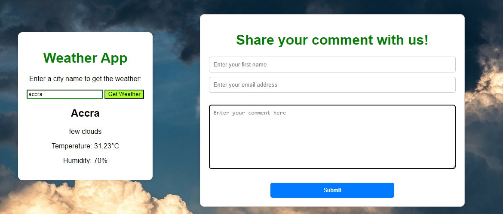

## Portfolio Project: Weather App

### Tagline: Research and Project Approval

### Team Member(s): Collins Wodopey

Role: Responsible for overseeing the overall project, creating the application from scratch to finish, settling timelines, and ensuring the project stays on track.

### Technologies:

- Languages: HTML, CSS, and JavaScript
- Alternatives: Node.js

### Challenge Statement:
The portfolio project is thereby a weather app created to provide users with up-to-date and accurate information about current and forecasted weather conditions. Weather apps typically offer features such as temperature, humidity, wind speed, precipitation chances, and forecasts for the upcoming hours, days, or even weeks. The portfolio project, which is the weather app ,  won't solve the underlying causes of weather phenomena themselves. While they provide valuable information to help individuals navigate and plan around weather conditions, they don't address the root causes such as climate change, atmospheric disturbances, or other factors influencing weather patterns. The portfolio project , which is the weather app will help the general public ie. everybody including farmers,travellers, Outdoor Enthusiasts, event planners, construction and maintenance workers , agriculturists and so on .The project can be relevant and useful for specific locales, but they can also provide value to users regardless of their location such as the local relevances,global coverages etc.

### Risks:

- Technical Risks:
    - Inaccurate weather data
    - API rate limits and usage quotas
    - Integrating and parsing data from APIs
    - Designing an intuitive and attractive user interface
    - Ensuring app works across multiple platforms
- Non-technical Risks:
    - Non-compliance with legal requirements and regulations
    - Low market demand or poor user adoption
    - Insufficient funding and budget overruns

## Potential impacts:
- Here are some of the potential impacts:                         
    - User Dissatisfaction: Inaccurate weather data can lead to a loss of trust and users abandoning the app.
    - Reputation Damage: Providing unreliable information can damage the developer's reputation and credibility.
    - Service Disruption: Exceeding API limits can result in service interruptions, leading to a poor user experience.
    - Unexpected Costs: Unplanned costs from exceeding API usage quotas can strain project resources.
    - App Crashes: Poor data parsing can cause app crashes or incorrect data display.
    - User Frustration: Users encountering errors or inconsistencies may stop using the app. etc.

### Safeguards/Alternatives:

- Regular updates to ensure data accuracy
- User feedback to improve data quality
- Local sensors for more precise data
- API alternatives with different rate limits and quotas
- Throttling to control API call frequency
- Edge caching to reduce API call frequency
- Validation libraries to validate data formats
- Mock data for testing
- Graceful degradation to ensure app functionality
- Design standards for platform-specific design
- Accessibility features for users with disabilities
- A/B testing for effective design elements
- Load testing for performance bottlenecks
- Microservices architecture for scalability
- Cloud services for reliability

### Infrastructure:

- No branching and merging in a team repository since the project was done by one person
- Deployment process:
    - Code review for quality and consistency
    - Unit tests, integration tests, and end-to-end tests for functionality
    - Manual testing for usability and cross-platform/device testing
    - Pushing to GitHub after thorough testing

### Existing Solutions:

- AccuWeather
- The Weather Channel (TWC)
- Dark Sky (now part of Apple Weather)
- Weather Underground
- Yahoo Weather

### Reimplementing a Proven Solution:

- Data Aggregation and Hyper-Local Forecasting
- Proven Solutions Overview:
    - AccuWeather: proprietary models and data aggregation
    - The Weather Channel: IBM Watson for data analytics and forecasting
    - Dark Sky: hyper-local, minute-by-minute forecasting
    - Weather Underground: data aggregation from personal weather stations
- Why Choose Data Aggregation and Hyper-Local Forecasting?
    - Accuracy: aggregating data from multiple sources
    - Localization: providing hyper-local forecasts
    - User Engagement: accurate, localized data increases user trust and engagement
- Implementation Approach:
    - Data Sources: integrate multiple reputable weather data APIs
    - Localization: use geolocation services for precise location data
    - Algorithms: develop algorithms to analyze and reconcile data from different sources

### Conclusion:
By understanding the landscape of existing weather apps and their approaches, you can identify gaps and opportunities for your app. Focusing on data aggregation and hyper-local forecasting allows you to offer a unique value proposition: highly accurate, localized weather information. This strategy leverages proven solutions while addressing specific user needs for precision and reliability.